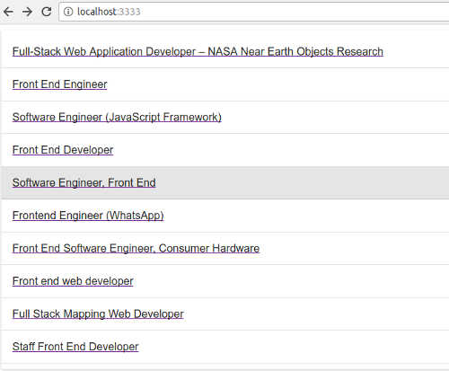
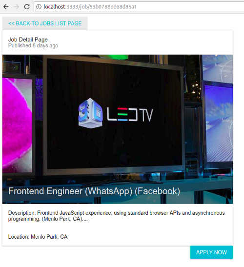

# React Job Postings

This is a​ simple mock up ​of a server rendered React web app which displays job postings.

There are two pages:

1. The Jobs List Page Displays a list of available jobs.

2. The Job Detail Page Displays all the information about an individual job.

## Getting Started

### Prerequisites

Make sure you have Node v6 or later and npm installed.

### Installing

1. Clone or download the repository.
2. `cd` into the project directory.
3. Run `npm install` to install the dependencies, build the app, and start the
	server
4. To see the app navigate your browser to http://localhost:3333

## Built With

* [Reactjs](https://reactjs.org/)
* [Webpack](https://webpack.js.org/)
* [Express](https://developer.android.com/studio/index.html)
* [React Redux](https://github.com/reactjs/react-redux)
* [Redux Thunk](https://github.com/gaearon/redux-thunk)
* [React Router](https://reacttraining.com/react-router/)
* [Material UI](https://expo.io/)

## Author

* **Karol Zyskowski**

Questions? Send an email to: k.zysk@zoho.com

## License

This project is licensed under the MIT License - see the
[LICENSE.md](LICENSE.md) file for details

## Acknowledgements

* https://www.udemy.com/server-side-rendering-with-react-and-redux
* https://www.udacity.com/course/react-nanodegree--nd019
* https://www.indeed.com/publisher
